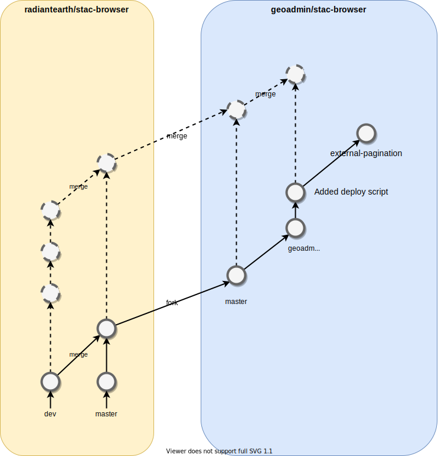

# STAC Browser for geo.admin.ch

This is a fork from [radiantearth/stac-browser](https://github.com/radiantearth/stac-browser) containing some
specific scripts and feature to deploy the STAC browser on [data.geo.admin.ch/browser/](https://data.geo.admin.ch/browser/).

- [GIT Branch Strategy](#git-branch-strategy)
- [Deploy](#deploy)

## GIT Branch Strategy

In order to simplify the merge from the fork, we are not allowed to do any changes directly into the `master` branch,
this branch should be kept up to date with the fork master branch.

Any geoadmin changes should be done in `geoadmin_master` branch. This branch follows the general geoadmin GIT FLOW rules.
To get the lastest changes from the radiantearth, we first merge radiantearth master branch into our master branch and
then merge our master branch into `geoadmin_master`. This way conflict are resolved locally between two branch of the same repo.



NOTE: the `external-pagination` branch is the current one deployed and is meant to be deleted when the pagination
is fully implemented by radiantearth repository.

## Deploy

The STAC Browser is deployed on Amazon S3 using the following script

```bash
./geoadmin/deploy.sh --staging dev
```

NOTE: You require to have your aws cli properly configured to run this script.
